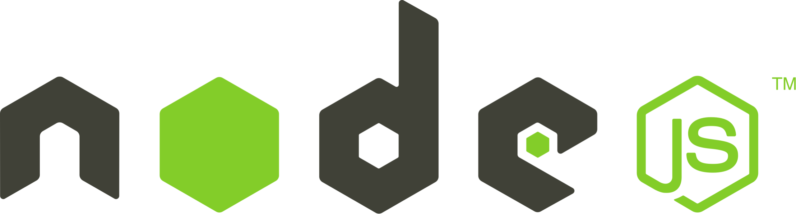

# Gym App

Created by Jack Hotchkiss

Started: April 12th, 2024  
Ended: Present

## About the Project

### Description

This project is a web app to help users track their progress on their fitness journey. It has features such as

- Workout Tracking
- Weight Tracking
- Exercise Tracking
- Split Creator

### Tech Stack

- <a href="https://nextjs.org/"></a>
- <a href="https://react.dev/"></a>
- <a href="https://typescriptlang.org/"></a>
- <a href="https://expressjs.com/"></a>
- <a href="https://nodejs.org/en"></a>

## Getting Started

_Follow the following steps to intall the app on your local machine_

### Prerequisites

- [NodeJS](https://nodejs.org/en/download/prebuilt-installer)
- [MySQL](https://dev.mysql.com/downloads/installer/)

### Installation

1. Clone the repo

```sh
git clone https://github.com/jackHotch/Gym-App.git
```

## Usage

_Follow the following steps to run the application on your machine_

### Before the First Time

1. Go into each `/Databse/* Parser/index.js` file and change the update the connection to your local database

```js
let con = mysql.createConnection({
  host: YOUR INFORMATION,
  user: YOUR INFORMATION,
  password: YOUR INFORMATION,
  database: YOUR INFORMATION,
});
```

2. Run each parsing file to populate the database

```sh
node index.js
```

3. In your terminal,

```sh
cd client
npm install

cd ../server
npm install
```

### Run the Application

1. Start your MySQL database
2. Open two terminal windows
3. In the first terminal window run

```sh
cd server
npm run dev
```

4. In the second terminal window run

```sh
cd client
npm run dev
```

5. Go to `http://localhost:3000` in your web browser
